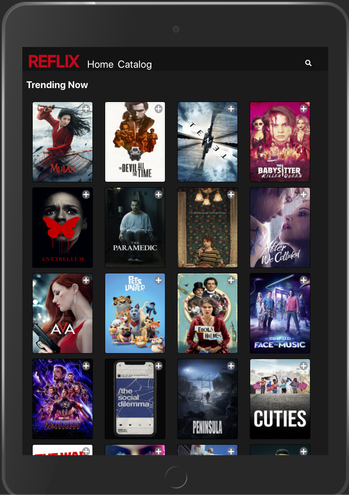

# Reflix

Reflix is a netflix clone application built with React, Deno and MongoDB.
Users can access their profile, view an updated list of movies, and search for various titles.
Users can also click on a movie to see more information about it.
Movies data provided by [The Movie Database](https://www.themoviedb.org/).

Demo: [https://rons-reflix.vercel.app/](https://rons-reflix.vercel.app/)

## Table Of Contents

- [Reflix](#reflix)
  - [Table Of Contents](#table-of-contents)
  - [Installation](#installation)
  - [Screenshots](#screenshots)
    - [Who's watching?](#whos-watching)
    - [Catalog](#catalog)
    - [Search Filter](#search-filter)
    - [My List](#my-list)
    - [Movie Details](#movie-details)
  - [Tech-stack - Client](#tech-stack---client)
  - [Tech-stack - Backend](#tech-stack---backend)

## Installation

1. Clone the repository and navigate to root directory.
2. Run `yarn install-client` to install client app dependencies.
3. Run `yarn dotenv` to generate .env files for both client and server.
4. Enter database credentials in `./backend/.env`.
5. Enter TMDB api key in `./client/.env`.
6. Run `yarn server` to start profiles server.
7. Run `yarn client` to start client app.
8. Navigate to `http://localhost:3000`.

## Screenshots

### Who's watching?

Main screen for user to select who they are.

### Catalog

### Search Filter

Search by movie title.

### My List

Once a user clicks on the plus button of each movie, it is being added to his list.

### Movie Details

A user can click on a movie to see more information about it.

## Tech-stack - Client

1. TypeScript.
2. UI - React, styled components.
3. State management - Redux toolkit.
4. HTTP Client - Axios.

## Tech-stack - Backend

5. Deno.
6. REST framework - Oak.
7. Database - MongoDB-Atlas.
