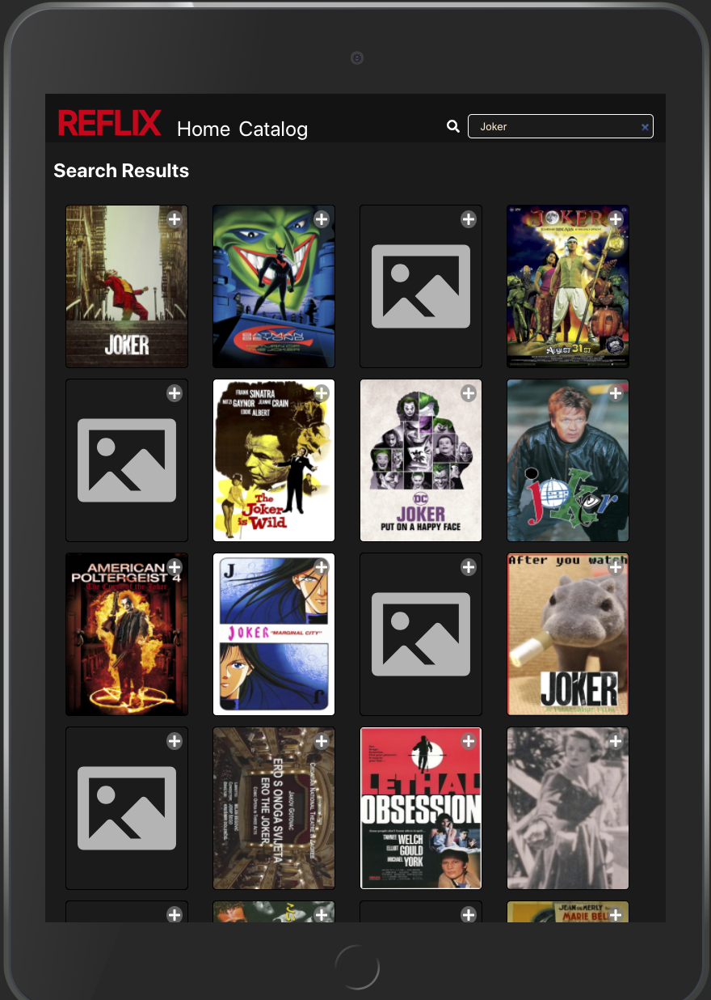
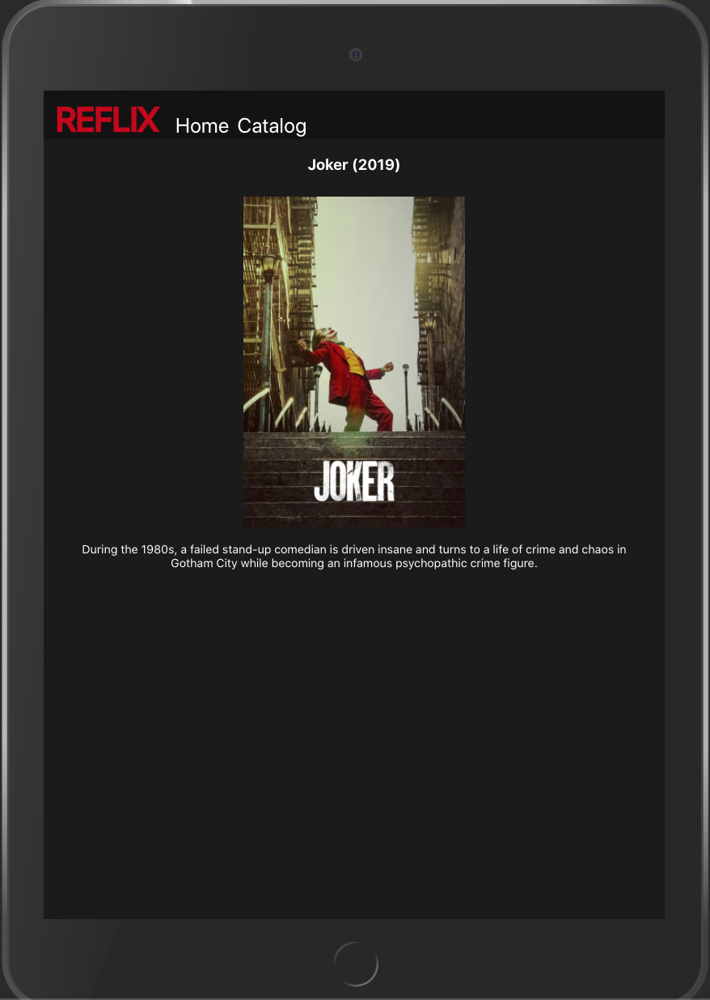

# Reflix

Reflix is a single page movie rental app built with React, Deno and MongoDB.
Users are able to choose their user and rent movies based on their budget.
Each user has a unique budget.
Users can also click on the movie to see more information about the movie.

Demo: [https://rons-reflix.vercel.app/](https://rons-reflix.vercel.app/)

## Table Of Contents

- [Reflix](#reflix)
  - [Table Of Contents](#table-of-contents)
  - [Installation](#installation)
  - [Screenshots](#screenshots)
    - [Who's watching?](#whos-watching)
    - [Movie Catalog](#movie-catalog)
    - [Search Filter](#search-filter)
    - [Rented Movies](#rented-movies)
    - [Movie Details](#movie-details)
  - [Tech-stack - Client](#tech-stack---client)
  - [Tech-stack - Backend](#tech-stack---backend)

## Installation

1. Clone the repository and navigate to root directory.
2. Run `yarn install-client` to install client app dependencies.
3. Run `yarn dotenv` to generate .env files for both client and server.
4. Enter database credentials in `./backend/.env`.
5. Run `yarn server`.
6. Run `yarn client` to start client app.
7. Navigate to `http://localhost:3000`.

## Screenshots

### Who's watching?

Main screen for user to select who they are.

### Movie Catalog

A user can see their budget and all the available movies to rent.

### Search Filter

As a user searches the movie catalog filters the movie based on the name.

### Rented Movies

Once a user rents a movie/s a new 'Rented' section appears on the page showing which movies they have rented.

### Movie Details

A user can click on a movie to see more information about the movie.

## Tech-stack - Client

1. TypeScript.
2. UI - React.
3. State management - Redux toolkit.
4. HTTP Client - Axios.

## Tech-stack - Backend

5. Deno.
6. REST framework - Oak.
7. Database - MongoDB-Atlas.
